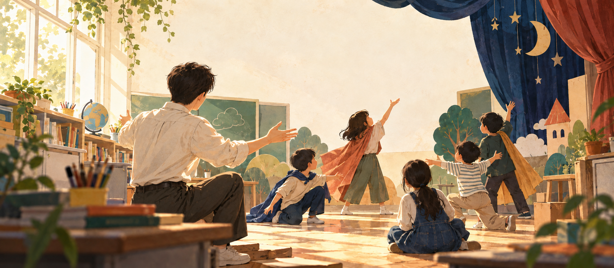
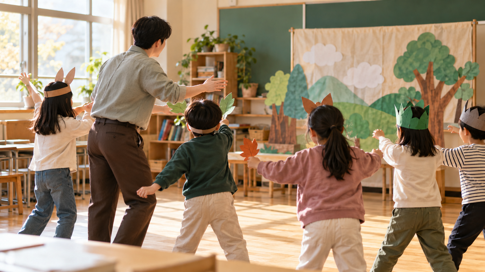

# 안녕하세요, 양연태입니다 🎭

**교육과 사회를 함께 생각하고, 교육연극을 실천하는 교사**

교실에서 시작된 질문을 수업과 이야기, 작은 도구로 이어 갑니다.

교육사회 · 교육연극 · 참여형 수업

---

### 교실을 바라보는 마음

학생은 저마다 다른 삶의 경험을 가지고 교실에 옵니다. 저는 그 차이가 배움의 출발점이 될 수 있다고 믿으며, 학교 안에서 누구의 목소리가 들리고 누구의 참여가 어려운지 살피고 싶습니다.

교육연극은 그 질문을 함께 탐색하는 방법입니다. 역할을 맡아 다른 사람의 자리에 서 보고, 장면을 만들고, 서로의 이야기를 들으며 생각을 넓혀 갑니다.

교육연극의 교실을 표현한 생성 이미지 · 실제 수업 현장 사진은 아닙니다.

### 제가 이어 가는 일

| 관심 | 교실에서의 방향 |
| :--- | :--- |
| **교육과 사회** | 학생의 삶과 배움, 학교 안팎의 관계와 기회를 함께 생각합니다. |
| **교육연극** | 역할, 장면, 대화를 통해 학생이 자기 목소리로 참여하도록 돕습니다. |
| **배움을 돕는 도구** | 즐겁게 시도하고 다시 도전할 수 있는 학습 경험을 만듭니다. |

### 교실에서 만든 것

#### 🌳 [베리숲 모험학교](https://yangyeontae-blip.github.io/math/)

초등학교 1~6학년 수학을 숲 탐험으로 만나는 3D 학습 게임입니다. 학생이 문제를 풀고, 힌트를 살피고, 다시 도전하며 자기 속도로 배울 수 있도록 만들었습니다.

[게임 해 보기](https://yangyeontae-blip.github.io/math/) · [프로젝트 살펴보기](https://github.com/yangyeontae-blip/math)

### 계속 품고 있는 질문

> 학생은 언제 자기 목소리로 말할 수 있을까?  
> 이야기를 함께 만드는 경험은 배움을 어떻게 바꿀까?  
> 누구나 참여할 수 있는 수업은 어떤 모습일까?

교육, 연극, 기술이 교실에서 만나는 과정을 이곳에 기록합니다.
