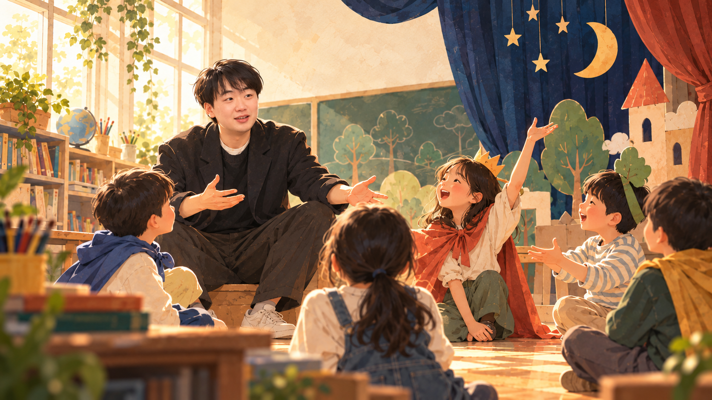
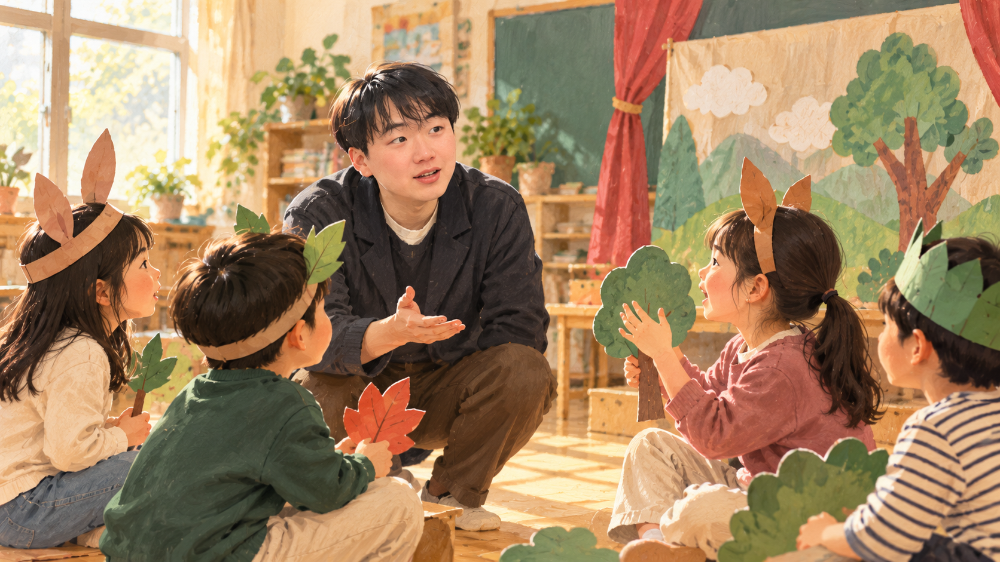

# 배움을 연구하고, 장면으로 열고, 도구로 만든다.

**교실의 질문을 교육연극 · 놀이 · 연구 · 기술로 확장합니다.**

학생이 자기 목소리로 참여하는 배움의 경험을 설계하는 교사이자 연구자입니다.

---

## 내가 만드는 배움

**연극으로 엽니다.**  
역할과 장면, 대화로 다른 사람의 자리에 서 보고, 서로의 이야기를 통해 생각을 넓히는 수업을 만듭니다.

**놀이로 연결합니다.**  
놀이를 흥미의 장식이 아니라, 학생의 관계·탐구·성장을 움직이는 교육과정으로 설계합니다.

**기술로 이어 갑니다.**  
교실에서 출발한 아이디어를 누구나 다시 시도할 수 있는 디지털 학습 경험으로 구현합니다.

제 사진을 참고해 만든 교육연극 일러스트 · 실제 수업 현장 기록 사진은 아닙니다.

---

## 연구와 현장

| 영역 | 기록 |
| :--- | :--- |
| **연구** | **2024** · 「한 초등학교 초임교사의 생존전략에 대한 자문화기술지」, *질적탐구* 10(2), 113–139 |
| **리더십** | **2024** · 학생중심연극교육연구회 회장 · 15명의 교사와 학생 주도 성장 및 교육연극 교수법 연구 |
| **현장 지원** | **2023–2025** · 충주 지역 놀이학년제 컨설턴트 · 놀이 기반 교육과정의 현장 컨설팅과 교사 역량강화 연수 참여 |

---

## 대표 프로젝트

### 🌳 [베리숲 모험학교](https://yangyeontae-blip.github.io/math/)

초등학교 1–6학년 수학을 숲 탐험으로 만나는 3D 학습 게임입니다. 문제를 풀고, 힌트를 살피고, 다시 도전하며 각자의 속도로 배울 수 있도록 만들었습니다.

[게임 해 보기](https://yangyeontae-blip.github.io/math/) · [프로젝트 살펴보기](https://github.com/yangyeontae-blip/math)

---

> 좋은 수업은 더 많은 목소리가 참여할 때 시작된다고 믿습니다.

교육, 연극, 놀이, 기술이 교실에서 만나는 과정을 이곳에 기록합니다.
